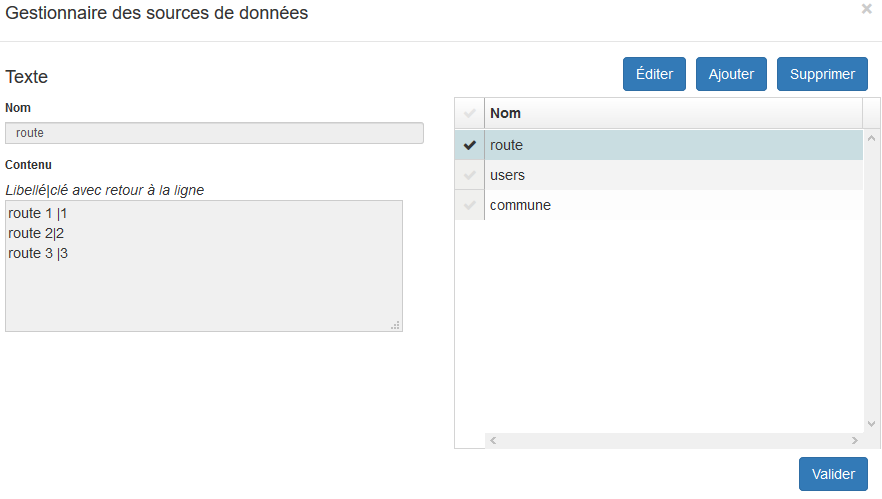
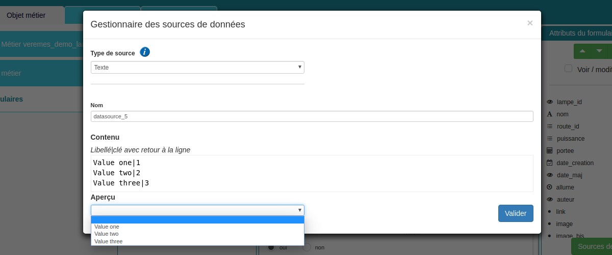
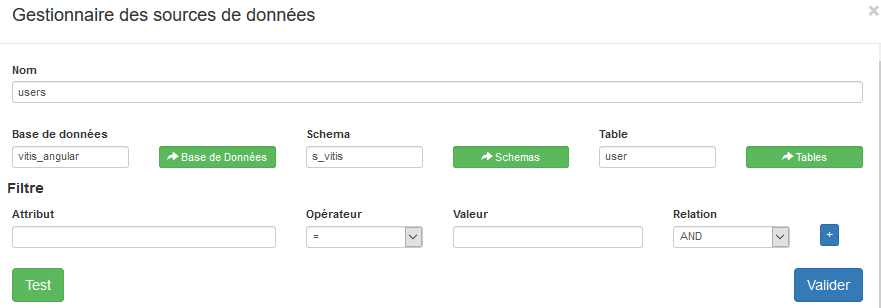
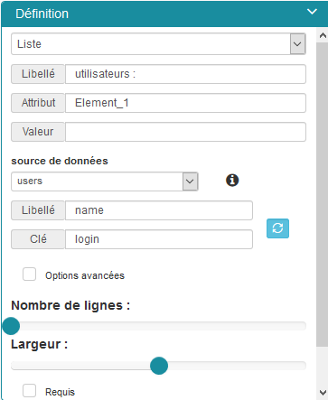
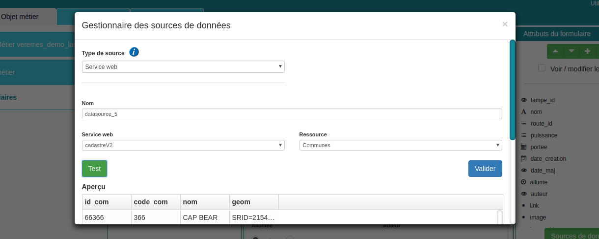
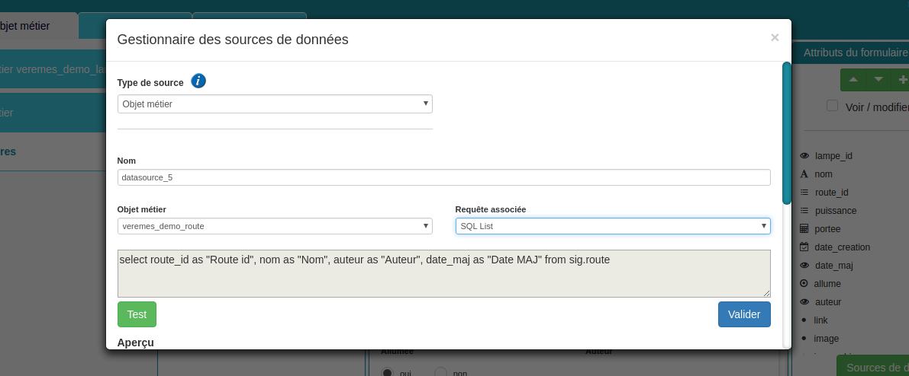
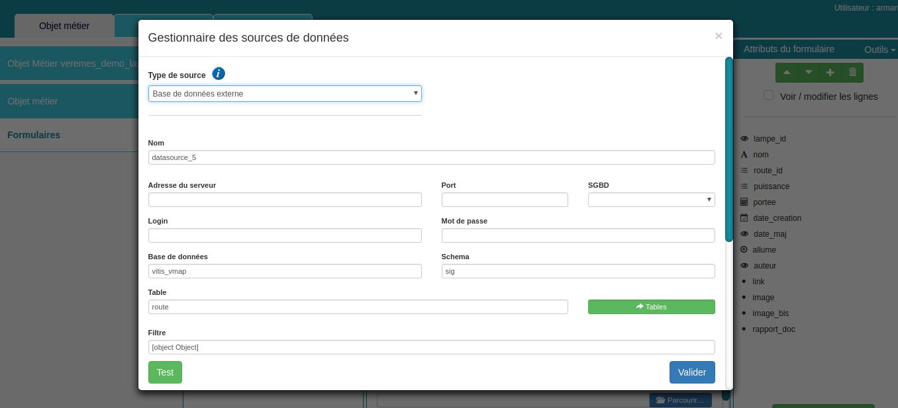

# Le Gestionnaire de source de données

Le gestionnaire de sources de données permet la création, l'édition et la suppression de sources de données à associer à des attributs de type :

-   liste
-   liste déroulante
-   liste double

Le gestionnaire de sources de données permet d'exploiter des données :

-   Texte : valeurs saisies directement dans le gestionnaire
-   Valeur de table locale : valeurs issues d'une table de base de
    données installée sur le serveur
-   Base de données externe : valeurs importées d'une table d'une base
    de données externe
-   Service web Vitis : permet d'exploiter un service web pour en
    récupérer les ressources
-   Objet métier : permet d'exploiter un objet métier déjà configuré

Le bouton **Sources de données**, en bas à droite du studio permet d'ouvrir le gestionnaire de source de données.

Une fois une source de données définie dans le gestionnaire, on peut créer dans le studio,  un attribut de
type "*Liste*" et choisir la source de données créée précédemment. 

##  1. Source de données de type texte

Le type texte permet de renseigner soi-même le contenu de la source de données.

    libellé 1|clé 1
    libellé 2|clé 2
    libellé 3|clé 3

Chaque entité est composée : 

- d'une **clé** qui est la valeur retenue
- d'un **libellé** qui est le contenu affiché dans le formulaire. 

Les deux sont séparés (sans espace) par le caractère "|". Répéter l'opération autant de fois que d'occurrences, en retournant à la ligne pour chaque élément.

##  2. Source de données de type valeurs d'une table locale

Ce type de source permet de récupérer directement en base de données le contenu d'une table. 
Définir : 

- le nom de la base de données
- le schéma
- la table

### 2.1 Affichage de la liste

On peut filtrer les enregistrements à afficher dans la liste. Pour cela renseigner : 
- l'attribut qui est le nom de la  colonne sur laquelle porte le filtre
- l'opérateur 
- la Valeur à utiliser pour définir la condition.

Le bouton "*+*" permet l'ajout de conditions et on  peut déterminer si les multiples conditions sont de type "*AND*" ou "*OR*".

**Important :** l'insertion de ce type de source de données (tables locales) utilise le token de connexion de l'utilisateur. Il faut donc faire attention à ce que **tous les utilisateurs susceptibles d'utiliser le formulaire aient des droits en consultation sur la table.**

### 2.2 Clé et libellé

Dans le studio, définir l'attribut et son libellé  à afficher dans le formulaire. 

Puis sélectionner la source de données précédemment créée dans le Gestionnaire de source de données. 

Définir ensuite le libellé et la clé des occurences de la liste : 

Dans l'exemple ci-dessus, on souhaite pouvoir sélectionner dans le formulaire les utilisateurs dont les noms (colonne name) seront affichés dans une liste ". La clé (colonne login) de chaque utilisateur est la valeur rééllement utilisée. 

### 2.3 Options avancées = affiner l'affichage des listes

 Il est possible d'affiner l'affichage des éléments de la liste via les commandes : 

- commandes de tri (order_by et sort_order) sur les attributs dont on spécifie les noms dans le champs Attributs. Ils doivent êtres séparés par le caractère |. 

- clause distinct pour distinguer les valeurs identiques. 

- filtre pour  filtrer les valeurs à afficher via une clause Where dont on spécifie les arguments dans le champ ' filter'. 

### 2.4 Listes en cascade

On peut choisir d'afficher une liste dont le contenu varie en fonction des valeurs sélectionnées dans une autre  liste. L'option Cascade permet le paramétrage de telles listes en spécifiant l'attrobut parent et l'attribut enfant sur lequel effectuer le filtre d'affichage.
 
**Attributs de filtrage et Signe de comparaison** 

Après avoir défini quel est l'élément  parent, il faut définir le champ enfant sur lequel repose l'ascendance ainsi que le signe de comparaison sur lequel doit reposer la comparaison entre les champs liant la table parent à la table enfant. 

Les signes de comparaison sont : 

- = Egalité parfaite entre le champ parent et le champ enfant
- > Ne seront affichés dans la liste enfant que les enregistrements dont la valeur est supérieure à l'attribut de filtre parent. 
- > Ne seront affichés dans la liste enfant que les enregistrements dont la valeur est inférieure à l'attribut de filtre parent. 
 
**Attendre le parent **

Pour forcer l'affichage de la liste des éléments enfants uniquement lorsqu'un élément parent est sélectionné, il faut cocher la case 'Attendre le parent'. Ainsi, si aucun élément parent n'est sélectionné, aucun élément enfant n'apparaîtra dans la liste. 
 

## 3. Source de données de type service web

On peut exploiter une ressource d'un service web précédemment créé, afin d'effectuer des requêtes complexes. On peut également se servir d'un services de l'application.

Le type de source "*Service web*" effectue une requête de type "*GET*" à la ressource sélectionnée.

## 4. Source de données de type objet métier

Il est également possible d'interroger directement un objet métier selon une des trois solutions suivantes :

-   **Form :** renvoie l’ensemble des colonnes de la table associée à
    l'objet métier
-   **SQL Summary :** renvoie de résultat de la requête définie par SQL
    Summary
-   **SQL List :** renvoie de résultat de la requête définie par SQL
    List

## 5. Source de données de type base de données externe

Plus complexe mais plus puissant, ce type de source permet d'interroger des bases de données d'un serveur externe selon un login et un mot de passe fourni.

Après avoir saisi le nom de la nouvelle source de données, saisir les paramètres de connexion à la base de données : 
- serveur
- port
- sgbd
- login
- mot de passe
- tables. Le bouton 'Tables' permet d'afficher la liste des tables de la base et de la sorte de s'assurer de la réussite de la connexion.  

Il est également possible de filtrer les données à importer via une clause de type Where, saisie dans le champs Filtre.

Le bouton 'Valider' permet de fermer la fenêtre en cours et revenir à liste des sources de données. 
Cliquer, à nouveau, sur Valider pour fermer le gestionnaire de source de données et revenir au studio. 

**Important : les login et mot de passe renseignés doivent être publics** car les utilisateurs finaux pourraient avoir accès à cette
information.

